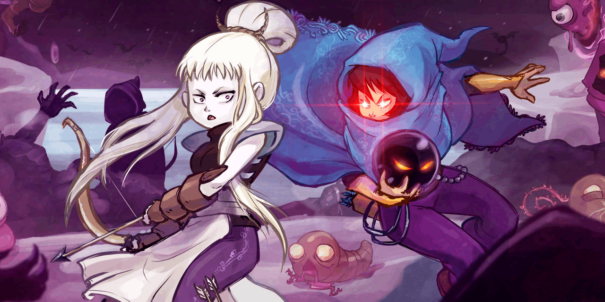

# Table of Contents  
- [Presentation](#presentation)
- Mods List
  - [TF-8 mod](#tf8mod)  v1.3 
  - [AI python mod](#aimod)   v0.1 
  - [PlayTag mod](#playtagmod) v0.1 
  - [AI Native mod](#ainativemod) v0.1
  - [Variant speed mod](#variantspeedmod) v0.1
  - [Variant control ghost mod](#variantcontroghostmod) V0.1
- [Acknowledgements](#acknowledgements)  

<a name="presentation">


# Presentation

**Works only with WIndows 10 - Steam Version of towerfall** (only full compatibility with DLC darkfall for now, do not know how it will works without the DLC)
This is a Compil of multiple Mods

- [Jonesey13](https://github.com/Jonesey13) : [https://github.com/Jonesey13/TF-8-Player](https://github.com/Jonesey13/TF-8-Player)
- AI python mod : https://github.com/ebe1kenobi/tf-mod-ai-python (fork + menu integration of [vcanaa](https://github.com/vcanaa) : https://github.com/TowerfallAi/towerfall-ai)
- PlayTag mod : https://github.com/ebe1kenobi/tf-mod-playtag
- AI Native mod : https://github.com/ebe1kenobi/tf-mod-ai
- Variant speed mod : https://github.com/ebe1kenobi/tf-mod-variant-speed
- Variant control ghost mod : https://github.com/ebe1kenobi/tf-mod-variant-control-ghost


 
**Best thanks to Jonesey13 and vcanaa.**

You can play 
- with or without 2 simple AI (with python or not)
- with or without your friends up to 8 player
- play a new game mode play tag
- with a new play tag treasure chest item
- and 2 variant mod that are not worth presenting, they were juste test

**Modification for the compil :**

- Select Player type (human, NAI AI) in archer select screen:
- 
- Mod 8 player always activated (can't be desactivated anymore)
- Mod AI native always activated (can't be desactivated anymore)
- Mod AI python activated by default (can be desactivated if you don't want python)
- AI native and AI python support for playtag mode
- correction keyboard config for AI
- AI name display instead of P1..P8
- PLaytag option in option screen (desactivated or countdown delay):
- 


## Installing

Only tested on Windows at the moment.

* Purchase the game [TowerFall Ascension](https://store.steampowered.com/app/251470/TowerFall_Ascension/) on steam. (**BUY IT**, best game ever)

* Locate `TowerFall.exe` in the game directory. To find it, go to Steam, right-click the game and navigate to `Properties > Local Files > Browse...`

* Download the mod from the latest [release](../../releases), unzip all its contents in the game directory. Make sure they are in the same directory as `TowerFall.exe`.

* If you do not have the DarkWorld Expansion, delete the DarkWorldContent folder.
* If you are using the Humble version, replace Content/Atlas/menuAtlas.xml with Content/Atlas/menuAtlas-Humble-Version.xml.

* Make sure the game is not running, then execute `Patcher.exe`. This will overwrite create the file `TowerFall.exe.ModCompilKenobi.exe`.
* Rename TowerFall.exe to TowerFall.exe.original
* Rename TowerFall.exe.ModCompilKenobi.exe to TowerFall.exe
* You will need python to use ai python mod :
  * download python : https://www.python.org/downloads/
  * install python and pip
  * 
  * 
  * 
  * then go in the towerfall directory and execute the command pip install to install the requires python lib :
  * 
 

**To activate some meodule you need to add option parameter to the towerfall.exe** :
  - [TF-8 mod](#tf8mod) : --8pmod
  - [AI python mod](#aimod)  : --aimod
  - [PlayTag mod](#tf8mod) : none
  - [AI Native mod](#tf8mod) : --nativeaimod (with --nativeaimodnokeyboard if you want to discard the keyboard for an AI)
  - [Variant speed mod](#tf8mod) : none
  - [Variant control ghost mod](#tf8mod) : none


## build the mod (for the devs)

- Clone this repository
```Shell
git clone https://github.com/ebe1kenobi/towerfall-mod-kenobi.git
  ```
- If you want to use the mod  [AI python mod](#aimod), you will need to
  - Install python 3 and add it to your SYSTEM PATH variable
  - Install pip to download the dependency
  - then go in your directory .\script and execute the command
  - ```Shell
  pip install -r python/requirements.txt
  ```
- You need to install visual studio 2022 community (free)
- Before opening the project, you need to dowload .NET 4 which is nortsuported anymore, on nuget :
  - https://www.nuget.org/packages/microsoft.netframework.referenceassemblies.net40
  - and copy the directory build\.NETFramework\v4.0 in C:\Program Files (x86)\Reference Assemblies\Microsoft\Framework\.NETFramework 
- You can now open the project with the file .\VSProject\ModCompilKenobi.sln

First you need to build the projects PatcherLib and Patcher because to build the project ModCompilKenobi we need a version of TowerFall.exe unsealed (with all the property and method public instead of private).


The assembly are in .\VSProject\ModCompilKenobi\bin\PatchWindows 

Then copy the original file TowerFall.exe from
```
C:\Program Files (x86)\Steam\steamapps\common\TowerFall\TowerFall.exe 
```
in
```
.\VSProject\ModCompilKenobi\bin\PatchWindows 
```
Then execute the script .\script\makebaseimage.bat (**change the path of your directory in .\script\config.bat**)

You should see the next result:

```
D:\__dev\code\towerfall\VSProject\ModCompilKenobi\bin\PatchWindows>Patcher.exe makebaseimage -t TowerFall.exe
Creating unsealed image from D:\__dev\code\towerfall\VSProject\ModCompilKenobi\bin\PatchWindows\Patcher\Original\TowerFall.exe
Unsealed binary created in D:\__dev\code\towerfall\VSProject\ModCompilKenobi\bin\PatchWindows\Patcher\Unsealed\TowerFall.exe

```

Then you can build the project ModCompilKenobi


This will build the ModCompilKenobi.dll in 
```
.\VSProject\ModCompilKenobi\bin\PatchWindows
```

You can use the scripts in .\script to release then deploy in the towerfall steam directory

In some case (crash of visual studio, or ...) you will need to force update the nugate package in the package manager console in "Tools > nugate package manager > package manager console", then execute the command :

```
update-package Microsoft.Bcl.Async -reinstall
```
See the package config file in .\VSProject\ModCompilKenobi\packages.config to see the list of package.

### Uninstalling
To uninstall this mod, right-click on the game and go to `Properties > Local Files > Verify integrity of game files...` This will download the unmodified file from Steam.

**Note:** The mod is uninstalled whenever the game is updated. To reinstall it, delete the `Patcher` directory and re-run the patch command.

## Known Limitation

- I Tested on Darkworld DLC only, I do not know how it will work without Darkworld DLC
- Can't play with 4 players team (for 8 player mod)
- When no option is set, the original game wil be executed.
- ON Quest and DarkWorld Mode, if you select AI agent above P4, the game will crash or some players wil be missing
- The AI agent (simple_agent.py) has not be modified, so in DarkWorld (or Quest?) mode, the agent will not jump in the portal when they won a game.
- On trials mode, the AI doesn't detect the enemy and do nothing
- playtag is not supported by AI mod

<a name="aimod">
  
# AI python mod


(1 human and 7 AI)
 


See : https://github.com/ebe1kenobi/tf-mod-ai-python

A mod that enables AI to play the game [TowerFall Ascension](http://www.towerfall-game.com). Get started with code examples in python to create your AI to play with (or against).

- the original option --aimod became **--aimodtraining**
- the **--aimod option** is now used to play with your friends or/and AI


**Game mode compatibility player :**

|Game mode|1 player|2 players|3 players|4 players|5 players|6 players|7 players|8 players|
|---------|--------|--------|--------|--------|--------|--------|--------|--------|
|Quest|X|X|||||||
|DarkWorld|X|X|X|X|||||
|Trials|X||||||||
|HeadHunters|X|X|X|X|X|X|X|X|
|Last Man Standing|X|X|X|X|X|X|X|X|
|Team Death Match|X|X|X|X|X|X|||
|Pay Tag|||||||||

**Game mode compatibility mod :**

|Game mode|aimod|8pmod|Aimod + 8pmod|
|---------|--------|--------|--------|
|Quest|X|X|X|
|DarkWorld|X|X|X|
|Trials|X|X|X|
|HeadHunters|X|X|X|
|Last Man Standing|X|X|X|
|Team Death Match|X|X|X|
|Play Tag|X|X|X|

## Play Game Versus AI when you're alone or with your friends

* Include `--aimod` in `Properties > General > LAUNCH OPTIONS`. Whenever you want to disable the mod and play the game normally, just remove the flag.
* If you run the game now, you should see a **black screen**.  The game is waiting for agents to connect.
* You need to execute the bacth TowerFall.bat which execute run_simple_agent.py, You don't need to run Towerfall.exe before, the script python will execute it if it is not executing.
* This script will connect up to 8 AI to the game according to the gamepad connected (the keyboard don't count) :
  
| number of gamepad connected | number of possible AI without 8pmode | number of possible AI with 8pmode |
| ------- | ------- | ------- |
|    0    |    4    |    8    |
|    1    |    3    |    7    |
|    2    |    2    |    6    |
|    3    |    1    |    5    |
|    4    |    0    |    4    |
|    5    |         |    3    |
|    6    |         |    2    |
|    7    |         |    1    |
|    8    |         |    0    |

**Info** : if you add the option `-nogamepads` the game will not show any gamepad and 4 AI can connect without physically deconnect the gamepads

On the Archer select screen, the AI agent use a keyboard config each, Select the AI you want to play with
 
**Keyboard config for each AI :**

<a name="aikeyboardconfiguration">
  
|Action | P1 | P2 | P3 | P4 | P5 | P6 | P7 | P8 |
| ----- | -- | -- | -- | -- | -- | -- | -- | -- |
|Down   | A  | Z  | D  | F  | G  | H  | J  | K  |
|Up     | Q  | S  | E  | R  | T  | Y  | U  | I  |
|Left   | O  | P  | W  | C  | B  | F9  | F11  | PageUp  |
|Right  | L  | M  | X  | V  | N  | F10  | F12  | PageDOwn  |
|Jump / select AI  | NumPad1 | NumPad2 | NumPad3 | NumPad4 | NumPad5 | NumPad6 | NumPad7 | NumPad8 |
|Shoot / deselect AI | F1 | F2 | F3 | F4 | F4 | F5 | F6 | F7 | F8 |
|Dodge  | F13  | F14  | F15  | F16  | F17  | F18  | F19  | F20  |

## Testing AI mod for training 

* Include `--aimodtraining` in `Properties > General > LAUNCH OPTIONS`. Whenever you want to disable the mod and play the game normally, just remove the flag.
* If you run the game now, you should see a **purple screen**. That is expected. The game is waiting for agents to connect and configure a match, which you will learn how to do in the sessions below.
* This is the --aimod from the original mod from vcanaa
* the training mode can use remote (AI agent) and human agent (see [run_simple_agent_headhunter_1human_vs_1agent.py](./python/run_simple_agent_headhunter_1human_vs_1agent.py)).
* When no human play the game on training mode, the menu will be selected automaticcaly and when the match end, a rematch will begin automatically

## Getting started with AI

Open a terminal and check that python is installed:

```shell
python --version
```

**Note:** If you are new to python, it is recommended installing it using a package manager, like [Miniconda](https://docs.conda.io/en/latest/miniconda.html) or another of your choice.

Install the required packages:

```shell
pip install -r python/requirements.txt
```

Run the 1v1 versus example:

```shell
python python/run_simple_agent_headhunter_1agent_vs_1agent.py
```

You should expect an output similar to this (it will look slightly different if the game is already opened):

```shell
Starting new process from C:/Program Files (x86)/Steam/steamapps/common/TowerFall/TowerFall.exe.
Waiting for available process.
```

After a few seconds, the game window will open and the match will start. Take a moment to enjoy watching the two little archers battle each other.

**Troubleshoot:** If it fails, but the game window is open, run the command again. Sometimes the game takes longer to start, which causes a timeout.

If you quit the game on training mode, a **purple screen** will appear. That is expected, and it means the game is waiting for a new connection. To quit, use ALT-F4, and close the shell windows too.

**Note:** You can still edit game options (like sound volume) by editing the `tf_savedata` file manually.

A match can be programmatically started in many configurations. Give each one of the other examples a try to see a few options:
- [run_simple_agent_quest_1agent.py](./python/run_simple_agent_quest_1agent.py)
- [run_simple_agent_sandbox.py](./python/run_simple_agent_sandbox.py)
- [run_simple_agent_teamdeathmatch_2agent_vs_2agent.py](./python/run_simple_agent_teamdeathmatch_2agent_vs_2agent.py)
- [run_simple_agent_headhunter_1human_vs_1agent.py](./python/run_simple_agent_headhunter_1human_vs_1agent.py)
- ...

### Code example walkthrough

Now that you saw it working, lets walk through one of the examples and learn how to use the API. Inspect the contents of [run_simple_agent_quest_1agent.py](./python/run_simple_agent_quest_1agent.py).

First step is creating an instance of `Towerfall`. It is a client that talks to the game (which itself acts as a server). The key part here is the `config`. That is how you select the `mode`, the `level`, number of agents, etc.

```python
  towerfall = Towerfall(
    verbose = 0,
    config = dict(
      # option for training mode
      difficulty='Normal', # Normal, Hardcore
      # randomLevel = True, # True False
      level=1, # mandatory if randomLevel != True
      # Minimum option for play game normally
      fps=60,
      agentTimeout='01:00:00',
      mode='Quest', #Quest, DarkWorld, Trials, LastManStanding, HeadHunters, TeamDeathmatch, ( not supported = Warlord)
      agents=[
        dict(type='remote', archer='blue')
        ],
    )
  )
```

You can tinker with this config a little. Change one of the agent types from `remote` to `human`. Or increase the `fps`, so the game runs faster (quite useful when developing). The [Config Reference](#config-reference) explains all parameters.

`Towerfall` gives you a management API. To actually play the game, it needs to create a connection for each agent using `towerfall.join()`. First, count how many connections are needed (exclude the human ones). Then, call `join` to create a connection that the agent will use:

```python

in   towerfall.run() :
----------------------

connections = []
agents = []
remote_agents = sum(1 for agent in towerfall.config['agents'] if agent['type'] != 'human')
for i in range(remote_agents):
  connections.append(towerfall.join(timeout=10, verbose=1))
  agents.append(SimpleAgent(connections[i]))
```

Now you can use the connection to read the state and send actions to the game in a loop:

```python
in     towerfall.run() :
------------------------
while True:
  # Read the state of the game then replies with an action.
  for connection, agent in zip(connections, agents):
    game_state = connection.read_json()
    agent.act(game_state)
```

**Note:** The server communicates with each connection independently, so you **have** to read the game_state from all of them (if you don't, the socket buffer can become full over time and the connection will eventually fail).

`SimpleAgent` class is a minimalist implementation of an agent that shows how to read the state, make a decision, and reply with actions. The code in [python/agents/simple_agent.py](./python/agents/simple_agent.py) is extensively explained with comments, so take some time to read it thoroughly. It is a good place to start by making small improvements, like:

* Shoot in more directions.
* Dodge arrows.
* Shoot only when there is no wall in between. Check [scenario](#scenario) message.

Once you are comfortable with the basics, read the [API](#api) section for more information.

## Config reference

```jsonc
{
  "mode": "HeadHunters", // Game mode, Mandatory. Possible values: Quest, DarkWorld, Trials, LastManStanding, HeadHunters, TeamDeathmatch
  "randomLevel": False, // the level selection will be randomize True/false/not set
  "level": 2, // Level selection. mandatory if randomLevel not set or false
   // [1-16] for LastManStanding, HeadHunters, TeamDeathmatch
   // [1-12] for Quest
   // [1-4] for DarkWorld
   // [1-16] for Trials (not working, the AI doesn't detect enemy yet, TODO)
  "subLevel": 0, // Sub-level selection. [1-3], For Trials only. Mandatory if randomLevel not set or false)
  "matchLengths": "Standard", // THe number of set in a match. possible value : Epic, Standard, Quick, Instant
  "skipWaves": 0, // Amount of waves to skip in quest mode.
  "fps": 60, // The number of frame per seconds, Mandatory
  "agents": [
    {
      "type": "remote", // Possible values:
          // remote: create slots for agents to connect to.
          // human: input is taken from normal input, like keyboard and gamepads.
      "archer": "blue",  // The selected archer. Possible values:
          // green
          // blue
          // pink
          // orange
          // white
          // yellow
          // teal
          // purple
          // red
          //
          // Each one accepts an alternative version, example: blue-alt
          // Some accept <color>-secret.
      "team": "red", // The team for TeamDeathmatch mode.
          // blue
          // neutral
          // red
    },
  ]
}
```

## API

### Messages

The agent listens to messages from the server and replies accordingly in a loop for as long as the match goes on. This is a reference to the meaning of each message and how the agent is supposed to reply to them.

#### `init`

The first message sent when a match starts.

```jsonc
{
  "type": "init", // Identifies the agent.
  "index": 0, // [0-3] Use this to identify your archer in 'update'.
  "version": "0.1.1" // The version of the mod.
}
```

Reply with `result`:

```jsonc
{
  "type": "result",
  "success": true
}
```

#### `scenario`

Since the scenario does not change much, it is sent only once in the beginning of a round, right after `init`.

```jsonc
{
  "type": "scenario", // Shows what the scenario grid looks like.
  "mode": "HeadHunters", //Quest, DarkWorld, ... the game mode to tell the AI how to determine enemy and allies
  "grid": [
    [0, 1, 1, 1, 0, ...],
    [0, 1, 1, 0, 1, ...],
    ...
  ], // 32 x 24 grid. 1 Means there is a block in that position blocking movement. 0 means empty. The first index of the grid corresponds to X coordinate, second index to Y coordinate.
  "cellSize": 10, // Each cell in the grid has dimensions (cellSize x cellSize). This value is unlikely to ever change, but it needs to be documented, so here it is.
}
```

Reply with `result`:

```jsonc
{
  "type": "result",
  "success": true
}
```

#### `update`

Every frame, an `update` is sent to indicate the current state of the game:
```jsonc
{
  "type": "update", // A normal update of the game state.
  "entities": [ // The list of entities, like players, arrows, enemies, etc.
    <Entity>,
    <Entity>,
    ...
  ]
}
```

For every `update`, reply with `actions`, containing the set of buttons to be pressed:

```jsonc
{
  "type": "actions",
  "actions": "jr" // The actions chosen by the agent. Each letter represents a pressed button. This example means that 'jump' and 'right' are pressed, and no other button is pressed. Mapping of all buttons:
      // r = right
      // l = left
      // u = up
      // d = down
      // j = jump
      // z = dash
      // s = shoot
      //
      // Changing arrows is not supported.
}
```

**Note:** The archer will not fire an arrow unless the `shoot` button is released. So in order to shoot, you have to include `'s'` in one frame and not include it in the next.
Same for dashing or jumping. If you keep `'j'` in all frames the archer will jump only once, or if you keep `'z'` in all frames, it will dash only once. They behave the same as if you were pressing the buttons in a real controller.

### Entities

Here is the reference of the entity types. Before diving on each one, know that every entity includes these properties:

#### `<Entity>`
```jsonc
{
  "id": 0, // An id to keep track of an entity over many frames.
  "pos": {"x": 0.0, "y": 0.0}, // 2D vector indicating the position of its center.
  "vel": {"x": 0.0, "y": 0.0}, // 2D vector indicating its velocity.
  "size": {"x": 0.0, "y": 0.0}, // 2D vector indicating its size.
  "isEnemy": true, // True if it is an enemy, false otherwise. Enemies refer to the monsters in quest mode. Players are not marked as enemies.
  "canHurt": true, // True if players die if they touch this entity. False if it is safe to touch.
  "canBounceOn": true, // True if it can get killed by bouncing on it. False if it doesn't die that way.
  "isDead": false, // True if entity is dead, false otherwise. Dead entities are sent because they might still attack when dead.
  "facing": 1, // -1 if it is facing left, +1 if it is facing right.
}
```

There are several types of entities. The most important ones make the top of this list:

#### `<Archer>`

This can be either the archer that player/agent controls, or the enemy archers that appear in quest mode.
```jsonc
{
  "type": "archer",
  ... // All properties from <Entity>
  "playerIndex": 0, // [0-3]. To identify yourself, match the value from 'init'.
  "team": "red", // Only used in TeamDeathmatch.
      // blue
      // neutral
      // red
  "aimDirection": {"x":1, "y":1}, // The direction of the aim as a 2D vector.
  "arrows": ["normal", "bomb", ...], // List of arrows that the archer is holding.
  "canHurt": true, // true if the archer can stomp on others.
  "dead": false, // true if dead. Useful when reviving teammates.
  "dodgeCooldown": 0, // Indicates how long until archer can dodge again. 0 if it can dodge now, more than 0 otherwise.
  "onGround": true, // true if stepping on the ground, false otherwise. Archer needs to be 'onGround':true to be able to jump.
  "onWall": false, // true if leaning on a wall, false otherwise. Archer needs to be leaning on wall to wall jump. They can also delay falling when holding the wall.
  "shield": false, // true if archer has a shield, false otherwise.
  "wings": false, // true if archer has wings, false otherwise.
  "state": "normal", // Possible archer states:
      // dodging
      // ducking
      // dying
      // frozen: Archer can't move. Usually in an intro scene, before round starts.
      // ledgeGrab
      // normal
}
```

#### `<Arrow>`
```jsonc
{
  "type": "arrow",
  ... // All properties from <Entity>
  "arrowType": "normal", // Possible arrow types:
      // bolt
      // bomb
      // bramble
      // drill
      // feather
      // laser
      // normal
      // prism
      // superBomb
      // toy
      // trigger
  "state": "shooting", // Possible states
      // buried
      // drilling: Specific for drill arrows when they go are digging through walls.
      // galling
      // gravity
      // layingOnGround: It can be picked up
      // shooting: Arrow is mid air.
      // stuck: It can be picked up
  "timeLeft": 0 // Specific to bomb arrows. It is the time until they explode.
}
```

#### `<Item>`
```jsonc
{
  "type": "item",
  ... // All properties from <Entity>
  "itemType": "arrowBolt", // Possible item types:
      // arrowBolt
      // arrowBomb
      // arrowBramble
      // arrowDrill
      // arrowFeather
      // arrowLaser
      // arrowNormal
      // arrowPrism
      // arrowSuperBomb
      // arrowToy
      // arrowTrigger
      // bomb
      // mirror
      // orbChaos
      // orbDark
      // orbLava
      // orbSpace
      // orbTime
      // shield
      // wings
}
```

#### `<Chest>`
```jsonc
{
  "type": "chest",
  ... // All properties from <Entity>
  "state": "closed", // Possible chest states:
      // appearing
      // closed
      // opened
      // opening
  "chestType": "normal", // Possible chest types:
      // autoOpen
      // bottomless
      // large
      // normal
      // special
}
```

Now the list of less remarkable entities by alphabetic order.

#### `<Birdman>`
```jsonc
{
  "type": "birdman",
  ... // All properties from <Entity>
  "state": "idle", // Possible birdman states:
      // idle: Flying around
      // attack: Performing an attack
      // resting: Can't attack
}
```

#### `<CrackedPlatform>`
```jsonc
{
  "type": "crackedPlatform",
  ... // All properties from <Entity>
  "state": "closed", // Possible chest states:
      // dead
      // respawning
      // shaking
      // shifting
      // waiting
}
```

#### `<CrackedWall>`
```jsonc
{
  "type": "crackedPlatform",
  ... // All properties from <Entity>
  "count": 5.0, // Count until it breaks. Breaks at 0.
}
```

#### `<EvilCrystal>`
```jsonc
{
  "type": "evilCrystal",
  ... // All properties from <Entity>
  "subType": "blue", // Possible subTypes:
      // blue
      // green
      // pink
      // red
}
```

#### `<Hat>`
```jsonc
{
  "type": "hat",
  ... // All properties from <Entity>
  "playerIndex": 0, // The index of the owner of the hat
}
```

#### `<FloorMiasma>`
```jsonc
// That little fire that appears from the floor.
{
  "type": "floorMiasma",
  ... // All properties from <Entity>
  "bottom": 0.0, // The height of the floor miasma.
}
```

#### `<Ghost>`
```jsonc
{
  "type": "ghost",
  ... // All properties from <Entity>
  "subType": "blue", // Possible subTypes:
      // blue
      // green
      // fire
      // greenFire
}
```

#### `<Icicle>`
```jsonc
{
  "type": "icicle",
  ... // All properties from <Entity>
  "falling": true, // True if the icicle is falling, false otherwise.
}
```

#### `<KingReaper>`
```jsonc
{
  "type": "kingReaper",
  ... // All properties from <Entity>
  "hasShield": true, // True if shield is activated, false otherwise.
}
```

#### `<KingReaperBeam>`
```jsonc
{
  "type": "kingReaper",
  ... // All properties from <Entity>
  "dir": {"x": 0.0, "y": 1.0}, // Direction of the beam. There are actually two beams starting from 'pos' and shooting to 'dir' and -'dir'.
  "width": 8.0, // Width of the beam.
}
```

#### `<Lantern>`
```jsonc
{
  "type": "lantern",
  ... // All properties from <Entity>
  "falling": true, // True if the lantern is falling, false otherwise.
}
```

#### `<Lava>`
```jsonc
{
  "type": "lava",
  ... // All properties from <Entity>
  "bottom": 0.0, // The height of the lava.
}
```

#### `<Miasma>`
```jsonc
// That purple fog that comes fromm the sides.
{
  "type": "miasma",
  ... // All properties from <Entity>
  "left": 0.0, // The left most safe area.
  "right": 0.0, // The right most safe area.
}
```

#### `<Orb>`
```jsonc
{
  "type": "orb",
  ... // All properties from <Entity>
  "falling": true, // True if the orb is falling, false otherwise.
}
```

#### `<ProximityBlock>`
```jsonc
// Block that let things pass when a player is close.
{
  "type": "proximityBlock",
  ... // All properties from <Entity>
  "collidable": true, // True if things collide with it, false otherwise.
}
```

#### `<ShiftBlock>`
```jsonc
// Block that moves to crush the player.
{
  "type": "shiftBlock",
  ... // All properties from <Entity>
  "startPosition": {"x": 0.0, "y": 0.0},
  "endPosition": {"x": 0.0, "y": 0.0},
  "state": "waiting" // possible states:
      // moving
      // shaking
      // waiting
}
```

#### `<Slime>`
```jsonc
{
  "type": "slime",
  ... // All properties from <Entity>
  "subType": "green", // Possible subTypes:
      // blue
      // green
      // red
}
```

#### `<SpikeBall>`
```jsonc
{
  "type": "spikeBall",
  ... // All properties from <Entity>
  "center": {"x": 0.0, "y": 0.0},
  "radius": 1.0,
}
```

### `<SwitchBlock>`
```jsonc
// Those red and blue blocks
{
  "type": "switchBlock",
  ... // All properties from <Entity>
  "collidable": true, // True if things collide with it, false otherwise.
  "warning": true, // True if it is about to switch.
}
```

#### All entity types

The complete list of entity types. A lot of them only has the regular `<Entity>` schema and is not documented above.

```
amaranthBoss
amaranthShot
arrow
bat
batBomb
batSuperBomb
bird
birdman
brambles
cataclysmBlade
cataclysmBlock
cataclysmBullet
cataclysmEye
cataclysmMissile
cataclysmShieldOrb
chain
chest
crackedPlatform
crackedWall
crown
crumbleBlock
crumbleWall
cultist
cyclopsEye
cyclopsFist
cyclopsPlatform
cyclopsShot
dreadEye
dreadFlower
dreadTentacle
dummy
enemyAttack
evilCrystal
exploder
explosion
fakeWall
flamingSkull
floorMiasma
ghost
ghostPlatform
graniteBlock
hat
hotCoals
ice
icicle
jumpPad
kingReaper
kingReaperBeam
kingReaperBomb
kingReaperCrystal
lantern
laserArrow
lava
loopPlatform
miasma
mirrorPickup
mole
moonGlassBlock
movingPlatform
mud
orb
player
playerCorpse
portal
prism
prismArrow
proximityBlock
purpleArcherPortal
sensorBlock
shiftBlock
shockCircle
slime
spikeball
switchBlock
technoMage
technoMissile
tornado
worm
```

## Communication Protocol

The game (server) and the agent (client) exchange messages over socket in the following protocol:
* `2 bytes` for the size `N` of the body (unsigned, big-endian).
* `N bytes` for the body, an `ascii` encoded JSON object. It contains the property `type`, which defines the set of other properties in the message.

See [Connection](./python/towerfall/connection.py) class for implementation details in python.

### Management API

Exchange starts with the client opening a new socket and sending a `config` message:

```jsonc
{
  "type": "config",
  "config": {
    "mode": "quest",
    "level": "2",
    "fps": 60,
    "agents": [
      {
        "type": "remote"
      }
    ]
  }
}
```

Server replies with a `result`, containing either success...

```jsonc
{
  "type": "result",
  "success": true
}
```

...or maybe an error, if something goes wrong:

```jsonc
{
  "type": "result",
  "success": false,
  "message": "Some reason why it failed."
}
```

**Note:** This socket can be either closed, or kept opened for further management API calls.

On success, one slot will be opened for every `remote` agent defined in config. Each of them opens a new socket and sends a `join` message:

```jsonc
{
  "type": "join"
}
```

Server again replies with a `result`, containing either success...

```jsonc
{
  "type": "result",
  "success": true,
  "message": "Game will start once all agents join."
}
```

...or maybe an error:

```jsonc
{
  "type": "result",
  "success": false,
  "message": "No open slot to join."
}
```

After successful `join`, this connection needs to be kept open to do all the communication for the entire match. The client waits for the game messages and reply accordingly, as explained in the [API](#api).

Management API also supports a `reset` message that can be used to choose the initial configuration of the entities in `sandbox` mode (trying to set the entities in any other mode doesn't take any effect).

```jsonc
{
  "type": "reset",
  "entities": [
    {
      "type": "bat",
      "facing": -1,
      "pos": { "x": 220, "y": 160 }
    },
  ]
}
```

See [reset_test.py](./python/reset_test.py) for a full list of entities supported in reset.

## Limitations

There are a few improvements that are tricky, but in theory possible. They might be implemented in the future:

* Support for Linux and Mac.
* Vectorized environments. Steam does not let multiple instances of a game run at the same time. But it would be possible to have one instance run multiple matches. This would be very useful for Reinforcement Learning approaches.


<a name="tf8mod">
  
# 8 Player TowerFall Mod 


A Towerfall mod that uses a modified version of the [Bartizan](https://github.com/Kha/Bartizan) modding framework and [Mono.Cecil](https://github.com/jbevain/cecil). Original copyright belongs to Matt Thorson.

**You need to add the option --8pmod to activate this mod**


## Features

* 8 player versus mode
* 3v3 in team deathmatch

<a name="playtagmod">
  
# PlayTag mod 

See https://github.com/ebe1kenobi/tf-mod-playtag


A new Game Mod to Play tag. Each round a player has It, and it must touch another player to pass It. All the player alive at the end of the round gain 1 point.
- No Arrow
- No kill on stomping
- Treasure chest will not give Arrows
- the player can be killed by the environment
- The shield can protect from It

In other versus mode, a treasure chest can give a hidden Play Tag item in the form of other items (arrow, orb, ...), you can't know if it is it or not :) It will spawn only once per match.
When a Player will take the false items, the playtag mode will activate for 10 seconds, then the normal mode will be back.


<a name="ainativemod">
  
# AI Native mod  

 See https://github.com/ebe1kenobi/tf-mod-ai


When activated by the option **--nativeaimod** (and optionnaly **--nativeaimodnokeyboard** if you want to play against up to 7 AI), the archer select screen will give you the choice to select one or multiple AI with the key 1 to 8. The AI are control like a keyboard, so each AI has a keyboard configuration (See [AI Keyboard Configuration](#aikeyboardconfiguration)

It's a bit dumb (the AI in the AI python mod is better, dumb too but better :) )

The Quest and Darkworld are not implemented yet.

<a name="variantspeedmod">
  
# Variant speed mod 

 See https://github.com/ebe1kenobi/tf-mod-variant-speed


You can speed up the game from X 1.1 to X10 ...

You need to add the variant in the match settings page

<a name="variantcontroghostmod">
  
# Variant control ghost mod 

 See https://github.com/ebe1kenobi/tf-mod-variant-control-ghost


On XBOX gamepad, the two upper trigger at the back of the gamepad is now used to activate a ghost deplacement, you will see...

You need to add the variant in the match settings page

There are two variant in ARCHERS (at the bottom of the page Variant, a second category ARCHERS exists) : normal and random

  - 
## Known Issues / Limitations
* You cannot have 4 players on a team. Don't even try! The game will crash. You'll have to patch your own levels to make this work!
* Some of the patched starting positions are a little broken but I've tried my hardest to space people out. It's the best I could do!
* The code was cobbled together in a short period of time just to get things working. You're probably going to be rather confused by it! For the brave who want to understand what on earth the code is doing, I recommend decompiling TowerFall.exe using something like .Net Reflector, Telerik's JustDecompile or ILSpy. You should also check out the Bartizan github page as well. Also feel free to contact me with any questions and I'll try my best to answer them.

<a name="acknowledgements">

# Acknowledgements

- [Extremely OK Games](https://exok.com), for making this awesome, lovely game.

- The developer of [Bartizan](https://github.com/Kha/Bartizan#installation), from where I borrowed the basic code for patching.
- The developer [vcanaa](https://github.com/vcanaa) of [towerfall_ai]([https://github.com/vcanaa](https://github.com/TowerfallAi/towerfall-ai))
- The developer [Jonesey13](https://github.com/Jonesey13) : [https://github.com/TowerfallAi/towerfall-ai](https://github.com/Jonesey13/TF-8-Player)

- Matt Thorson and everybody else who contributed to making such an awesome game!
- Everybody who worked on the Bartizan project which allowed the mod to be open-sourceable
- All those who worked on Mono.Cecil
- Alec Gibson for suggesting that someone should make this mod in the first place
- Everybody at Softwire and RCVGS who tested the earlier versions of the mod

